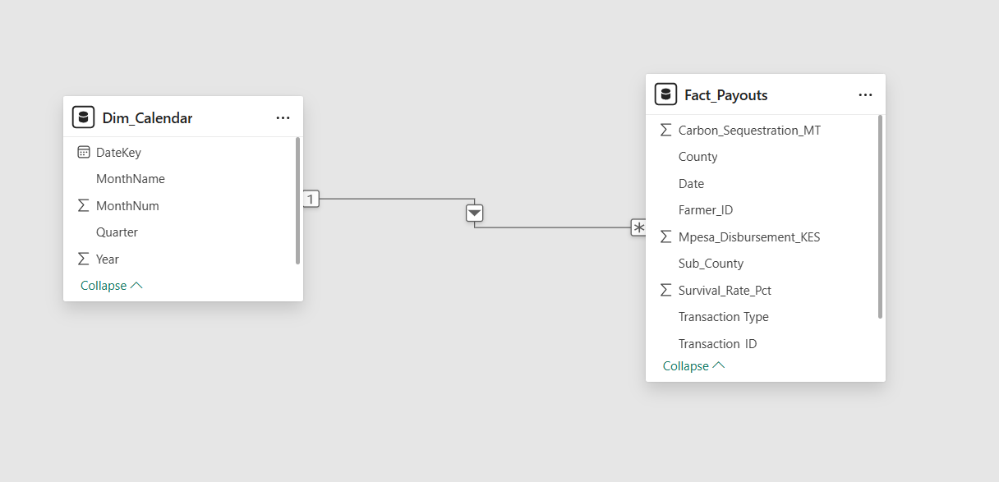

# Kenya Carbon FinTech & Agroforestry Analytics

An analytics engineering and data modeling project focused on Results-Based Financing (RBF) for smallholder agroforestry initiatives in Kenya. This project processes transactional mobile money (M-Pesa) micro-payouts distributed to farmers, mapping financial deployment against ecological impact metrics like tree survival rates and carbon sequestration.

##  Project Overview & Domain Context
In climate finance and international development, sustainability projects are moving toward **Results-Based Financing**. Instead of paying strictly for upfront tree planting, local NGOs incentivize long-term canopy growth by tracking tree survival. 

This repository models a dataset of carbon credit payouts, capturing two distinct phases of environmental stewardship:
1. **Initial Planting Payouts:** Capital distributed when new seedlings are actively put into the ground.
2. **Maintenance & Survival Payouts:** Recurring micro-incentives distributed to farmers for keeping existing trees alive (where `Trees_Planted = 0` but an M-Pesa disbursement is logged).

---

##  Data Architecture & Pipeline

### 1. ETL & Data Pipeline (`/scripts/etl_pipeline.m`)
Built completely using **Power Query M-Language**, the ingestion pipeline handles data cleaning, transformation, and optimization at source:
* **Business Logic Mapping:** Implemented conditional logical parsing to explicitly split transaction cohorts into `Initial Planting Payout` and `Maintenance Payout` based on survival milestone rules.
* **Type Enforcement:** Explicitly declared strict data types across columns to maximize VertiPaq storage compression and enforce referential integrity.
* **Dynamic Dimension Generation:** Programmed a dynamic temporal calendar master dimension (`Dim_Calendar`) using pure M-code to allow for future time-intelligence calculations (YoY growth, moving averages).

### 2. Star Schema Data Model
The project architecture strictly adheres to a **Star Schema** dimensional design layout optimized for lightning-fast DAX analytical performance. 

* **Fact Table:** `Fact_Payouts` (Captures transactional financial metrics, sub-county regions, and sequestration values).
* **Dimension Table:** `Dim_Calendar` (Provides clean lookup granularities for Year, Quarter, Month Name, and Month Number).
* **Filter Flow:** Established a clean, high-performance **$1\rightarrow *$ (One-to-Many) relationship** flowing downwards from `Dim_Calendar[DateKey]` to `Fact_Payouts[Date]`.

Our structural model view layout is tracked here:

---

## Explicit DAX Measures (Core KPI Engine)
To maintain structural safety and ensure calculations aggregate correctly across visual slicers, all metrics are programmed using explicit DAX measures stored inside a centralized virtual schema table:

* **`Total Disbursements (KES)`**: Tracks total financial capital funneled into rural banking channels via mobile money.
* **`Total Carbon Sequestration (MT)`**: Measures the overall ecological yield and climate mitigation impact in metric tons of CO2.
* **`Average Tree Survival Rate`**: Tracks aggregate forest permanence and conservation project efficiency.

---

##  How to Explore the Repository
* `/data`: Contains the core seed tracking dataset (`mpesa_carbon_payouts.csv`).
* `/scripts`: Holds the reusable Power Query M pipeline code (`etl_pipeline.m`).
* `/images`: Contains documentation diagrams of our database relationships.
* `/dashboards`: Stores the underlying Power BI workspace file (`Kenya_Green_Finance_Analytics.pbix`).